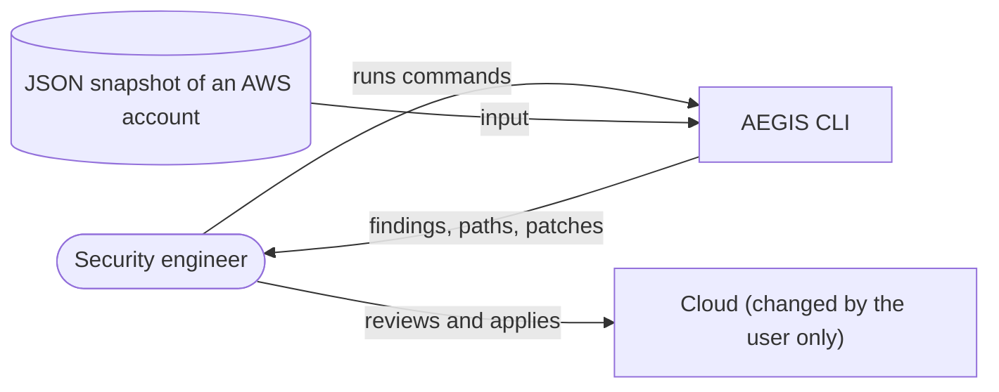

# 001: System context

Status: Current (single-user command-line tool)

```mermaid
flowchart LR
    U(["Security engineer"]) -->|"runs commands"| A["AEGIS CLI"]
    S[("JSON snapshot of an AWS account")] -->|"input"| A
    A -->|"findings, paths, patches"| U
    U -->|"reviews and applies"| C["Cloud (changed by the user only)"]
```

AEGIS reads a snapshot and never calls the cloud itself.
