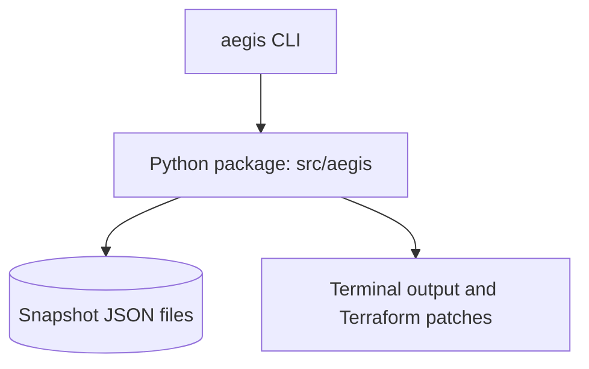

# 002: Container architecture

Status: Current

```mermaid
flowchart TD
    CLI["aegis CLI"] --> PKG["Python package: src/aegis"]
    PKG --> SNAP[("Snapshot JSON files")]
    PKG --> OUT["Terminal output and Terraform patches"]
```

One installable Python package (see ADR-0002). No server and no database.
