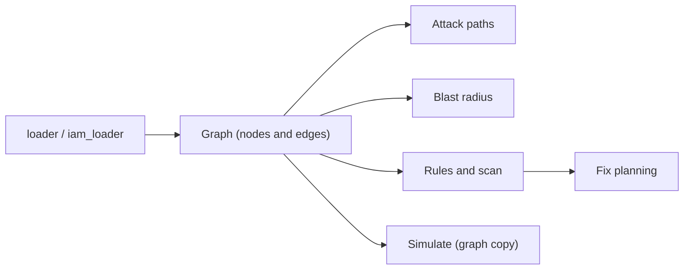

# 003: Component architecture

Status: Current

```mermaid
flowchart LR
    L["loader / iam_loader"] --> G["Graph (nodes and edges)"]
    G --> P["Attack paths"]
    G --> B["Blast radius"]
    G --> R["Rules and scan"]
    G --> SIM["Simulate (graph copy)"]
    R --> F["Fix planning"]
```

The IAM loader reads the output of `get-account-authorization-details`.
Every analysis works on the same graph (see ADR-0003).
