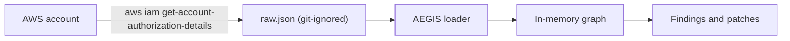

# 004: Cloud data flow

Status: Current (collection is done by the user, not by AEGIS)

```mermaid
flowchart LR
    AWS["AWS account"] -->|"aws iam get-account-authorization-details"| EX["raw.json (git-ignored)"]
    EX --> LD["AEGIS loader"]
    LD --> GR["In-memory graph"]
    GR --> RES["Findings and patches"]
```

Real exports contain account data and must not be committed.
