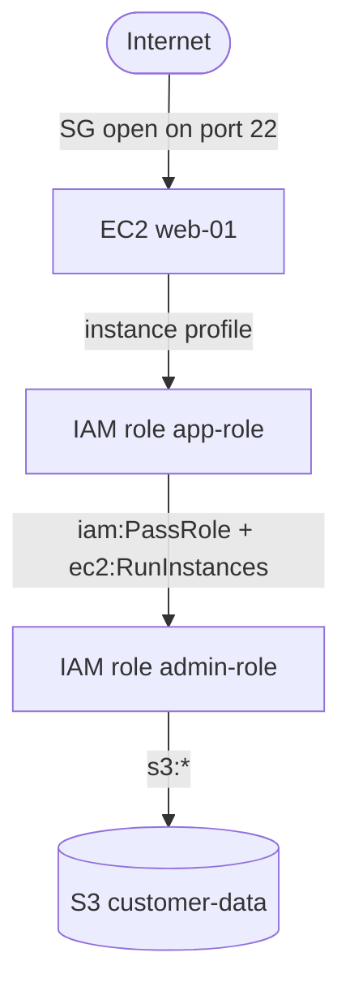

# 005: Identity attack path

Status: Current (reference scenario, also deployable with aegis-vulnerable-lab)

```mermaid
flowchart TD
    I(["Internet"]) -->|"SG open on port 22"| E["EC2 web-01"]
    E -->|"instance profile"| R["IAM role app-role"]
    R -->|"iam:PassRole + ec2:RunInstances"| A["IAM role admin-role"]
    A -->|"s3:*"| S[("S3 customer-data")]
```

Each step looks minor alone. Together they reach sensitive data.
