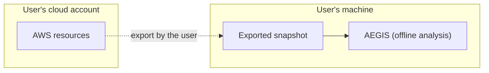

# 008: Trust boundaries

Status: Current

```mermaid
flowchart LR
    subgraph Cloud["User's cloud account"]
        AWS["AWS resources"]
    end
    subgraph Local["User's machine"]
        EX["Exported snapshot"]
        A["AEGIS (offline analysis)"]
    end
    AWS -.->|"export by the user"| EX
    EX --> A
```

AEGIS holds no cloud credentials (see ADR-0007).
The only data crossing the boundary is the snapshot the user exports.
