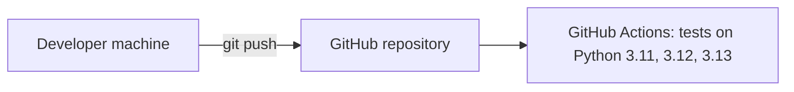

# 009: Deployment architecture

Status: Current

```mermaid
flowchart LR
    DEV["Developer machine"] -->|"git push"| GH["GitHub repository"]
    GH --> CI["GitHub Actions: tests on Python 3.11, 3.12, 3.13"]
```

AEGIS runs locally with `pip install -e .`.
There is no hosted service. A REST API and dashboard are on the roadmap.
